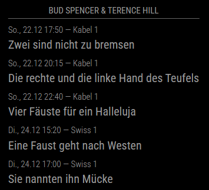

# MMM-SpencerHill

Module for [MagicMirror²](https://magicmirror.builders/) to display broadcast schedules of Bud Spencer and Terence Hill movies in the German-speaking region.

## Requirements

* Finished the [installation of MagicMirror²](https://docs.magicmirror.builders/getting-started/installation.html).

## Installation

* Clone this repository into your `/MagicMirror/modules` directory.
* Update the `/MagicMirror/config/config.js` to include the module:

```js
{
  module: "MMM-SpencerHill",
  position: "top_center",
  config: {
    // overwrite default config values here
  }
}
```

## Configuration

These are the possible configuration options and their default values:

```js
{
  module: "MMM-SpencerHill",
  position: "top_center",
  config: {
    // Set the header above the module. Leave empty to hide the header.
    header: 'Bud Spencer & Terence Hill',
    // Set the update interval in miliseconds in which the data will be fetched.
    updateInterval: 3600000, // 1 hour
    // Set a list of television channels that should not be displayed.
    blacklist: [],
    // Set a list of television channels that should be displayed and discard the rest.
    whitelist: [],
    // Set the locale for the module to German 'de' or English 'en'.
    locale: 'de',
  }
}
```

## Examples

Screenshot of the module with default configuration values:



## Development

### Requirements

* Node version 22.11.0 or higher
* Docker version 27.2.0 or higher (only for testing)

### Commands

To install all packages run:
```
npm install
```

To develop on the module and automatically reload the build run:
```
npm run develop
```

To build the project and bundle it:
```
npm run build
```

To check for linting errors in the code:
```
npm run lint:check
```

To fix the linting errors in the code:
```
npm run lint:fix
```

To test the built files in a fresh environment:
```
docker compose up
```
